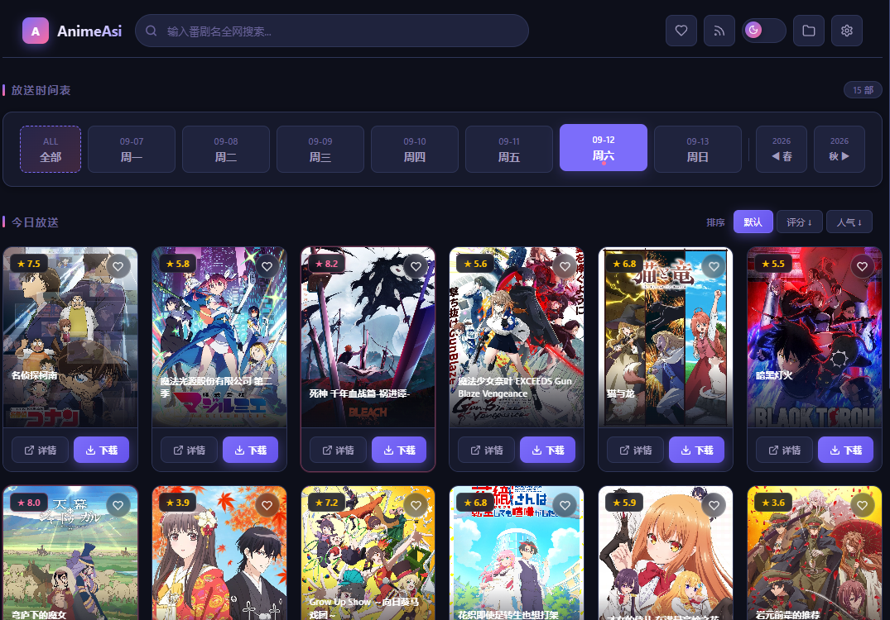
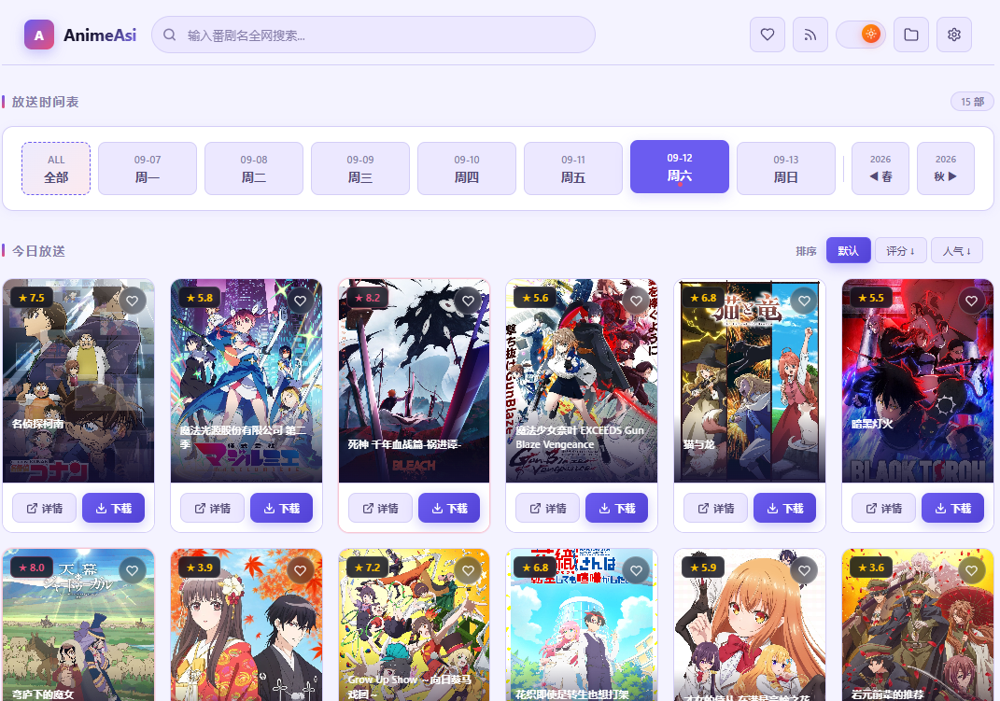
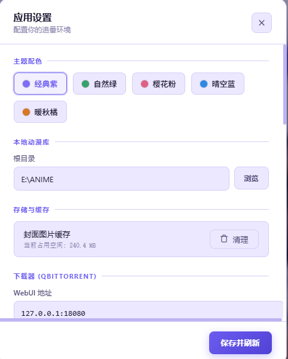
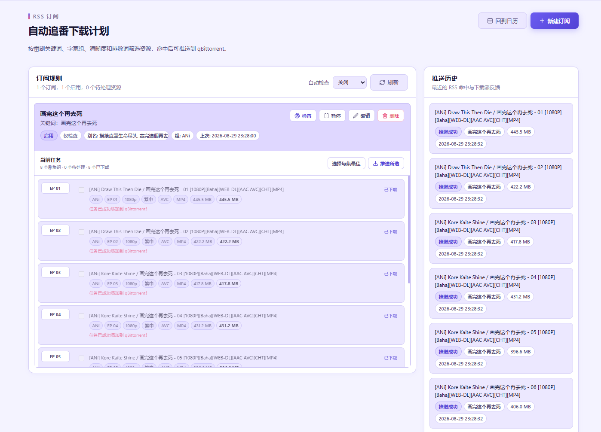

<div align="center">

# 🌸 AnimeAsi

**全能轻量桌面追番中枢**

一款专为 Windows 打造的沉浸式追番桌面工具。基于 Python + pywebview 原生构建，深度整合 Bangumi 番组计划、多源种子聚合检索、智能 RSS 自动追番、qBittorrent 一键推送与本地媒体库管理。

[](https://github.com/MonoAska/AnimeAsi/releases/latest)
[](https://github.com/MonoAska/AnimeAsi)
[](https://www.python.org/)
[](LICENSE)

<br>

[🚀 下载最新便携版 (v1.7.2)](https://github.com/MonoAska/AnimeAsi/releases/latest) · [✨ 核心特性](#-核心特性) · [📖 快速上手](#-快速上手) · [⚙️ 进阶配置](#️-进阶配置与说明) · [🛠️ 开发者指南](#方式二源码运行适合开发者)

</div>

---

> 💡 **关于开发**：本项目完全由 AI 辅助生成，作者无编程背景，仅提供功能需求与测试反馈。代码可能存在不规范之处，欢迎提出 Issue 和 PR 共同改进！

---

## 📸 界面预览

| 🌙 经典夜间模式 (深紫) | ☀️ 纯净日间模式 (浅紫) |
| :---: | :---: |
|  |  |

| 🎨 独立双模主题调色盘 | 📡 自动化 RSS 追番计划 |
| :---: | :---: |
|  |  |

---

## ✨ 核心特性

- 📅 **每日放送与季度漫游**：同步 Bangumi 每日放送时刻表，支持历年季度归档自由穿梭，精准过滤日漫主线与番组标签。
- 🌓 **独立双模多色体系**：
  - 导航栏复古药丸滑块，支持日间 ☀️ / 夜间 🌙 一键随心切换。
  - 内置经典紫、自然绿、樱花粉、晴空蓝、暖秋橘 **10 套专属双模式调色方案**（5 套深邃夜间 + 5 套清爽日间）。
- 🔍 **多源种子聚合检索**：并行聚合蜜柑计划、动漫花园、Nyaa 等主流源，智能识别字幕组、画质规格、集数及文件体积。
- ⚡ **qBittorrent 深度联动**：一键推送到下载队列；若 qBittorrent 未运行，支持后台自动拉起并连接。
- 📡 **智能 RSS 自动化追番**：按关键词、字幕组过滤词自动监控更新，支持后台定时静默检查及多集一键批量推流。
- 🎬 **本地视频库与追番足迹**：自动扫描本地番剧文件夹，智能解析剧集并记录播放进度，一键调用系统默认播放器。

---

## 🚀 快速上手

### 方式一：直接运行（推荐普通用户）

1. 前往 [Releases 页面](https://github.com/MonoAska/AnimeAsi/releases/latest) 下载最新的 `AnimeAsi.exe`。
2. 双击即可运行（免安装单文件，绿色便携）。
   > *注：Windows 11 通常已内置所需 WebView2 运行库；Windows 10 如提示缺少环境，请前往微软官网安装 Microsoft Edge WebView2 Runtime。*

---

### 方式二：源码运行（适合开发者）

```bash
# 1. 克隆仓库
git clone https://github.com/MonoAska/AnimeAsi.git
cd AnimeAsi

# 2. 创建并激活虚拟环境
python -m venv venv
.\venv\Scripts\activate   # Windows PowerShell

# 3. 安装依赖项
pip install pywebview bottle requests feedparser qbittorrent-api pycparser

# 4. 启动应用
python main.py
```

### 📦 打包单文件可执行程序

```powershell
pip install pyinstaller
python -m PyInstaller build.spec
# 打包产物输出至 dist/AnimeAsi.exe
```

---

## ⚙️ 进阶配置与说明

### 1. qBittorrent 联动配置
- 打开 qBittorrent 客户端：**工具** → **选项** → **Web UI**，勾选“开启 Web 用户界面”。
- 在 AnimeAsi 的「设置」弹窗中填入 WebUI 地址（默认 `http://127.0.0.1:8080`）及用户名密码。
- 可选填 qBittorrent 程序路径，推送下载时若检测到未运行将自动帮您启动客户端。

### 2. 网络与代理设置
- Bangumi API 国内网络通常可直连。
- Nyaa.si、TokyoTosho、ACG.RIP 等外网源可能需要代理环境：可在设置中开启本地代理（如 `127.0.0.1:7890`）。

### 3. 本地动画库识别规则
在设置中指定根目录后，推荐以下文件结构：
```
D:\Anime\
  └── 葬送的芙莉莲\
        ├── [字幕组] 葬送的芙莉莲 - 01 [1080P].mp4
        └── [字幕组] 葬送的芙莉莲 - 02 [1080P].mp4
```

---

## 🏛️ 项目架构

```
AnimeAsi/
├── animeasi/                   # 后端核心业务模块
│   ├── cache/cover_cache.py    # 封面本地多级缓存
│   ├── downloads/              # 多源种子搜索、过滤、去重与 qBt 客户端
│   ├── season/browser.py       # Bangumi 季度漫游与日漫标签过滤
│   ├── subjects/               # 数据模型与统一卡片契约
│   ├── database.py             # SQLite 持久化层
│   ├── local_manager.py        # 本地视频检索与播放管理
│   └── rss_subscription.py     # RSS 规则评估与任务推送
├── WEB/                        # 前端应用资源
│   ├── index.html              # 主界面结构与交互粘合
│   └── static/
│       ├── css/app.css         # 10 套双模主题体系与现代化 UI 样式
│       └── js/                 # 卡片渲染、下载弹窗与 RSS 组件
├── docs/images/                # 项目文档与 README 高清预览截图
├── main.py                     # 应用入口、Bottle 容器与 pywebview JS 桥接
└── build.spec                  # PyInstaller 单文件打包规范
```

---

## 📄 开源许可

本项目采用 [MIT License](LICENSE) 开源。
